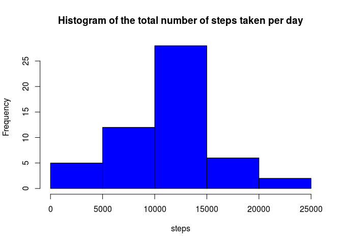
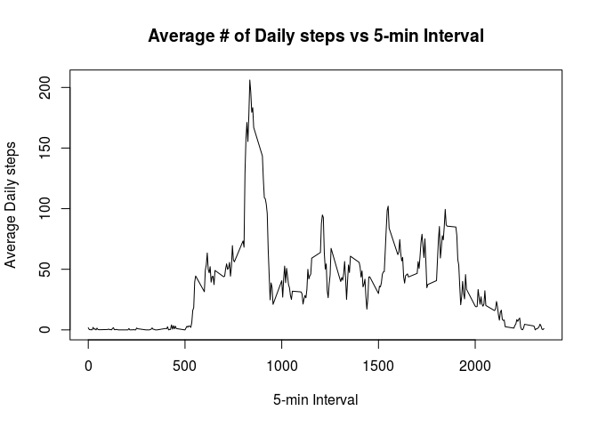
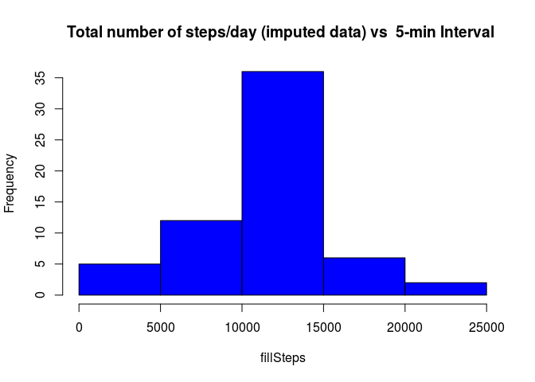
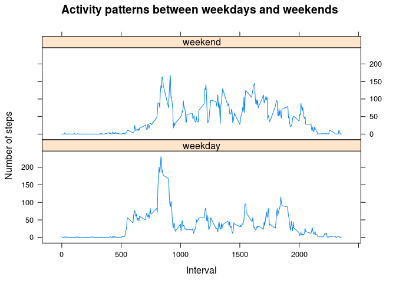

## Loading and preprocessing the data
  1.  Loading the Data

```r
rm(list=ls())
library(data.table)
table=data.table(read.csv("activity.csv"))
```

  2.  Processing the Data

```r
complete=table[complete.cases(table)] # table without NA
stepsbyday=complete[,.(total=sum(steps)),     
                    #Agregate 
			              by = .(date)]
stepsbyinterval=complete[,.("Average Daily steps"=mean(steps)), 
                         #Agregate 
                         by = .(interval)]
```

## What is mean total number of steps taken per day?

  1. Calculate the total number of steps taken per day:

```r
steps=stepsbyday$total
```

  2. Construct Histogram with calculated data:

```r
hist(steps,col = "blue",main="Histogram of the total number of steps taken per day")
```



  3.  Calculate and report the mean:

The mean total number of steps taken is 10766 and 
the median is 10765


## What is the average daily activity pattern?
  1.   Make a time series plot (i.e. type = "l") of the 5-minute interval (x-axis) and the average number of steps taken, averaged across all days (y-axis)

```r
#Plotting the Average Daily steps as a function of 5-min Interval
with(stepsbyinterval,plot(interval,`Average Daily steps`,type="l",xlab="5-min Interval",main="Average # of Daily steps vs 5-min Interval"))
```



  2.   Which 5-minute interval, on average across all the days in the dataset, contains the maximum number of steps?

```r
#Get max interval value 
MaxInterval= stepsbyinterval[which.max(`Average Daily steps`)]$interval
```
The interval with maximum average number of steps is 835.

## Imputing missing values
  1.  Calculate and report the total number of missing values in the dataset (i.e. the total number of rows with NAs)

```r
NumberOfRowsWithNA=dim(table)[1]-dim(complete)[1]
```
There is  2304 rows with missing values.

  2.  Devise a strategy for filling in all of the missing values in the dataset. 

```r
	#Deciding Strategies
	isThereEnoughInformationToFillNAwithDailyMeanSteps=length(intersect(table[is.na(steps)]$date,stepsbyday$date))>0

#is There Enough Information To Fill NA with Daily Mean Steps?
  #Answer == FALSE/NO
```

The chosen strategy is to fill the **NA**(s) with the  mean for that 5-minute interval.

  3.  Create a new dataset that is equal to the original dataset but with the missing data filled in.
  

```r
#Lets fill the Na(s) with the 5-min-average for all days:
	fillNa=table[,.(imean=mean(steps,na.rm=TRUE),steps,date),
			by =.(interval)]
	fillNa[is.na(steps)]$steps=as.integer(fillNa[is.na(steps)]$imean)

#Extracting total steps taken with filled table
	fillSteps=fillNa[,.(total=sum(steps)),
			by = .(date)]$total
```

  4.  Make a histogram of the total number of steps taken each day
  

```r
#Ploting
	hist(fillSteps,col="blue",main = "Total number of steps/day (imputed data) vs  5-min Interval ")
```


 	
  and Calculate and report the mean and median total number of steps taken per day.
 	
The mean total number of steps taken for the imputed data is 10749 and 
the median is 10641
	

## Are there differences in activity patterns between weekdays and weekends?

  1.  Create a new factor variable in the dataset with two levels – “weekday” and “weekend” indicating whether a given date is a weekday or weekend day.

```r
#Add Categories
# To add categories I calculated the number of days since the first date of the dataset.
# Knowning it to be Monday it was just a matter to divide by 7 and taking the rest.
# the rest+1 is in the range 1:7, dividing by 6 and rounding down I have 0 associated with
# weekdays and 1 associated with weekends.
# This number is a possible index to the array below which produce the desired category.
#( I chose this method because it is Locale insensitive.)
	WeekCategories=c("weekday","weekend")
	fillNa[,day:=as.factor(
			WeekCategories[
				as.integer(
				(as.numeric(as.Date(date)-as.Date("2012-10-01"))%%7+1)/6)+1])]
```

  2.  Make a panel plot containing a time series plot (i.e. type = "l") of the 5-minute interval (x-axis) and the average number of steps taken, averaged across all weekday days or weekend days (y-axis). :

```r
	WeekDay=fillNa[day==WeekCategories[1],
			.("Number of steps"=mean(steps))
                     	,by = .(interval)]
  	WeekDay$day=WeekCategories[1]
  	WeekEnd=fillNa[day==WeekCategories[2],
			.("Number of steps"=mean(steps))
			,by = .(interval)]
	WeekEnd$day=WeekCategories[2]

#Putting it all back together  
	week=merge(WeekDay,WeekEnd,all = TRUE ,by = names(WeekDay))

#We plot
	library(lattice)
	xyplot(`Number of steps` ~  interval | day,data=week,layout= c(1,2),type="l",xlab="Interval",main = " Activity patterns between weekdays and weekends")
```



